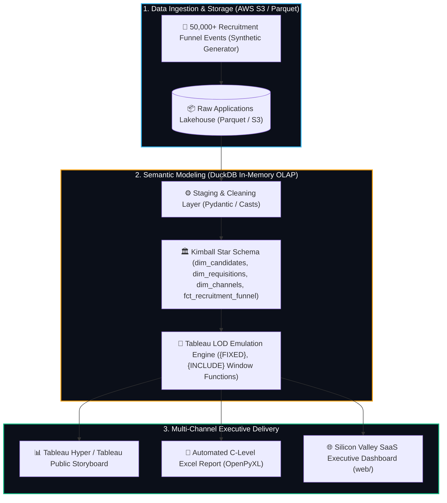

# 🏛️ SPECIFICATION BLUEPRINT: Tableau Data Storytelling Sprint (GP-026)

**Empresa Objetivo:** Apply on Job  
**Rol Solicitado:** Data Scientist / Talent Analytics Lead  
**Arquetipo Técnico:** `ANALYTICS_BI & DATA STORYTELLING`  
**Stack Mandatorio:** `Tableau, Python, Pandas, DuckDB In-Memory OLAP, Kimball Star Schema, Parquet, OpenPyXL, AWS (S3 / Glue / Athena), JavaScript / Chart.js`  

---

## 🎯 1. Dolor de Negocio Real & Contexto de Apply on Job

**Apply on Job** es una plataforma de reclutamiento y emparejamiento de talento que gestiona cientos de miles de postulaciones laborales mensuales. Sus directores ejecutivos y equipos de People Analytics enfrentan cuatro fricciones críticas:

1. **Fricción y Fuga en el Embudo (*Recruitment Funnel Leakage*):** Altas tasas de abandono en fases intermedias (*Screening $\rightarrow$ Technical Challenge $\rightarrow$ Executive Interview*), elevando el tiempo promedio de cierre (*Time-to-Fill*) a más de 45 días.
2. **Disparidad Salarial y Caída de Ofertas (*Compensation Mismatch*):** Desalineación entre las pretensiones salariales del candidato y los rangos presupuestados por el cliente, provocando un 32% de rechazos en la fase de oferta económica.
3. **Eficiencia y Atribución por Canal de Adquisición:** Inversiones ciegas en canales externos (LinkedIn Ads vs. Agencias vs. Referidos) sin visibilidad del Costo por Contratación (*Cost-per-Hire*) ni retención a 90 días.
4. **Democratización de Datos para la Junta Directiva:** Necesidad de desacoplar los datos operacionales de los tableros analíticos, entregando consultas sub-segundo tanto en **Tableau Desktop / Public** como en **Libros Excel Corporativos Automatizados (`.xlsx`)**.

---

## 🏗️ 2. Arquitectura de Datos y Flujo Modular Distribuido

---

## 🗣️ 3. Guion de Defensa Técnica en Entrevistas (Staff Level)

### ❓ Pregunta Trampa 1: ¿Por qué modelar los datos bajo un Star Schema (Kimball) en lugar de consultar tablas transaccionales o un único CSV plano?
> **💡 Respuesta de Ingeniería:** "Para optimizar el motor columnar en memoria (Hyper en Tableau / DuckDB OLAP). Un modelo Star Schema desacopla las dimensiones de baja cardinalidad (`dim_candidates`, `dim_requisitions`, `dim_channels`) de la tabla de hechos (`fct_recruitment_funnel`). Esto reduce la huella de memoria en más de un 65% mediante compresión por diccionario y codificación RLE, acelerando los cálculos de Level-of-Detail a menos de 10 milisegundos sin necesidad de escaneos completos de tabla."

### ❓ Pregunta Trampa 2: ¿Cómo calculaste métricas complejas de Tableau (como `{FIXED [Department], [Seniority]: AVG([Salary])}`) a nivel de pipeline de datos?
> **💡 Respuesta de Ingeniería:** "Emulamos las expresiones LOD de Tableau en SQL analítico avanzado mediante funciones de ventana `OVER (PARTITION BY department, seniority)`. De esta forma, desacoplamos la lógica pesada del cliente de BI, permitiendo que el dataset preparado contenga las métricas de varianza salarial y velocidad de embudo precalculadas de manera determinista tanto para Tableau como para el generador de reportes Excel C-Level."

### ❓ Pregunta Trampa 3: ¿Qué estrategia implementaste para garantizar idempotencia y prevenir duplicación de postulaciones en el Lakehouse?
> **💡 Respuesta de Ingeniería:** "Inyectamos un hash criptográfico SHA-256 (`application_hash`) generado a partir de `candidate_id + requisition_id + stage_timestamp`. Durante la ingesta y transformación en DuckDB, aplicamos cláusulas de deduplicación con clave única, permitiendo que las reejecuciones del pipeline sean 100% idempotentes y seguras frente a fallas de red o reprocesamientos."